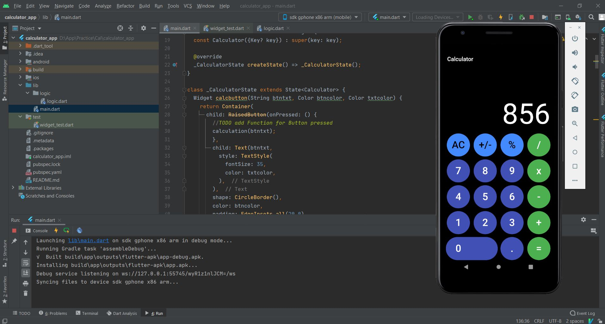
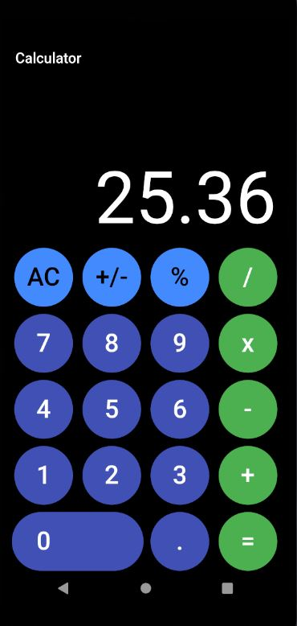

# CALCULATOR

Simple Calculator App Developed Using Flutter SDK and Android Studio

# INFO

Simple mobile application developed by using flutter SDK and Android Studio in Dart language. Like iPhone calculator design UI
Color codes: 
#FF3F51B5
#FF4CAF50
#FF000000
#FFFFFFFF

Supports simple operations such as Additon,Multiplication,Division,Subtraction

# IMAGES

# LICENSE
MIT License: 
Feel free to use the code as you please

